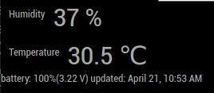

# ShellyPlus-HT Adapter

## Description
This is a simple MagicMirror module to display the sensor data (temperature,humidity and Voltage) of one ShellyPlus HT Adapter on the Magic Mirror (Forked from previous Shelly-HT module)

The module uses the Shelly+ HT API over LAN to get the sensor data. For details, check here: 

https://shelly-api-docs.shelly.cloud/gen2/Devices/ShellyPlusHT/

To work properly, it's best to have a static IP for your Shelly. Since it's using LAN connection, no authentication is needed towards the API

Current status is proven to work on my Magic Mirror and the one of my friend....

Feel free to enhance and include more features :)

## Module Screenshot


## Prerequisites
You need to have a MagicMirror up and running, and also a Shelly+ HT sensor with a fixed IP.

The MagicMirror must have the legacy "request" Package installed  :

```
npm install request
```

or use the alternative without any guaranty :

```
npm i postman-request
```

## Installing

Go to your MagicMirror directory
```
cd modules
git clone https://github.com/Medve01/Shelly-HT.git
```
check our the config.sample.js in the module directory. 

Copy the content to your config.js and change it as necessary. 

You have to adopt the ShellyHTApiPath-entries to your device's IP address needs.

Restart the MagicMirror and enjoy.

Note: ShellyPlus HT is asleep normally and just wakes up for a few seconds periodically or in case the sensor reads updated values.


## Debugging

If you encounter problems , the just simply use your browsers in-built web-console IDE ( usually available by pressing STRG + Shift + i ) and look for shelly's API communication
Or read the MagicMirror Log-file for any hints....
